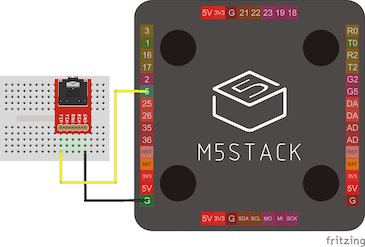

# バーチャルサイクリング

[](https://opensource.org/licenses/MIT)

市販のエアロバイクで仮想サイクリングを実現するためのアプリ一式です。


以下の機材とアプリから構成されています。

* エアロバイク用 回転数取得機材 (M5Stack製)
* エアロバイク用 回転数送信用アプリ
* iOS用 ストリートビュー表示アプリ

エアロバイクにM5Stackで作成した簡易的な機材を接続することで、iOSアプリで表示したストリートビューとエアロバイクの回転が連動できるようになります。
エアロバイク用アプリとiOS用アプリ間ではBluetoothを使用してデータを連携します。


## :warning: 注意事項

- このアプリは電気信号等を制御するため、使用機材に予期せぬ損害を与える可能性があります。
  もしも損害が発生した場合、エアロバイクの通常の使用方法とは異なるためメーカー保証の対象外となります。

- このアプリはGoogleストリートビューを使用するため、動作にはGoogle Cloud PlatformのAPI Keyが必要です。
  APIの使用分に対して料金が発生するため、Googleの利用規約、料金設定をご確認ください。

- 記載されている機材等は開発時に使用したものを記載してあります。それらの機材での動作を保証するものではありません。

- これらのリスクを十分にご理解頂いた上で、自己責任においてご利用ください。


## 構成図


## エアロバイク用機材の作成

### 使用機材

* [アルインコ コンフォートバイクⅡ](https://www.alinco.co.jp/product/fitness/detail/id=4175)
* [M5Stack Basic](https://www.switch-science.com/catalog/3647/)
* [SideBB for M5Stack(ブレッドボード)](https://www.switch-science.com/catalog/4098/)
* [3.5mm オーディオジャック](https://www.switch-science.com/catalog/619/)
* [ジャンパワイヤ](https://www.switch-science.com/catalog/314/)

### 作成手順

1. M5Stackのボトムを外し、代わりにSideBBを接続します
2. SideBBに回線図を参考ににオーディオジャック、ジャンパワイヤを設置します
3. Arudiono IDEなどを使用して、M5Stackに[IndoorBike.ino](IndoorBike/IndoorBike.ino)をインストールします

    |  回路図 |
    | :-------------: |
    |   |
    | オーディオジャックの左右のピンとGND、5番を接続します  |

### 設置手順

1. エアロバイク備え付けのモニターに接続されているオーディオケーブルを外します
2. 外したケーブルを、作成したメーターのオーディオジャックに接続します


    |  オーディオケーブル位置 |
    | :-------------: |
    |   |

    |  接続例 |
    | :-------------: |
    |   |


## iOS用アプリの作成

### 要求環境

- iOS 13.5
- Xcode 11.5
- Swift 5.0

### ビルド&実行手順

1. [Google Cloud Platform Console](https://cloud.google.com/console/)からAPI Keyを発行します。以下のAPIを有効化してください。
    - Maps JavaScript API
    - Geocoding API
2. [index.html](iOS/VirtualCycling/www/index.html)をテキストエディタで開き、`YOUR_API_KEY` を取得したAPI Keyに書き換えます。
    ```html
    https://maps.googleapis.com/maps/api/js?key=YOUR_API_KEY&callback=initialize
    ```
3. Xcodeで[VirtualCycling.xcodeproj](iOS/VirtualCycling.xcodeproj)を開きます。
4. Runボタンを押してアプリを実行します。

## 使用方法

1. エアロバイク側のアプリを起動します
2. iOS端末側のアプリを起動します
3. エアロバイクを回転すると、iOSアプリ側のストリートビューが移動します

**方向を変える**

顔を左右に傾けることで、方向を変更することができます。


**現在座標を変える**

左下のジャンプボタンを押すと、ストリートビューの現在座標が変わります。


## 作成者

Watanabe Toshinori – toshinori_watanabe@tiny.blue


## ライセンス

このプロジェクトはMITライセンスです。詳細は [ライセンス](LICENSE) ファイルを参照してください。


## 謝辞

このアプリを作成するにあたり、以下の記事・ライブラリを参照いたしました。

* [Aerocraft](https://github.com/mizucoffee/Aerocraft)
* [【フィットネスバイク】のインターネットを作る！！:Qiita](https://qiita.com/ie4/items/130308793444bd98179f)
* [M5Stack Bluetooth LE通信テスト](https://github.com/FromF/M5Stack-Color-BluetoothLE)
